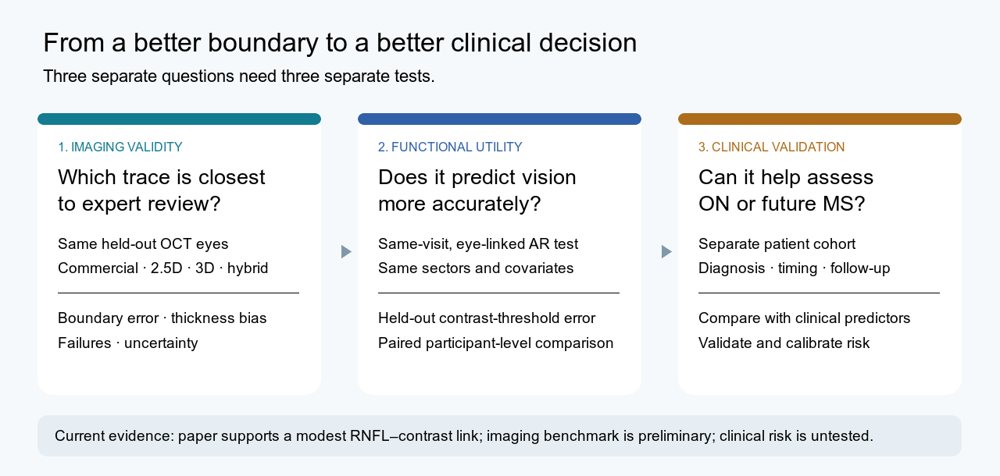

# RNFL segmentation → visual function

**Research plan | 8 October 2026 | No clinical model validated**

We are asking whether a better algorithm for tracing the retinal nerve fiber layer (RNFL) on optic-disc OCT produces a **better measurement** and, more importantly, a **more useful measurement**. The planned comparison puts raw Visionix Solix output and several machine-learning methods on the *same eyes*, checks them against expert-adjudicated traces, and tests whether their RNFL thickness features predict independently measured contrast sensitivity.

## Start here

| Document | What it answers |
| --- | --- |
| [Research question and abstract](RESEARCH_BRIEF.md) | What is the paper claiming and how can we describe it now? |
| [Frontier ML Models & Taxonomy](ml-models/README.md) | Architectural diagrams, 3D tensor specifications, and held-out cohort benchmark matrix for all frontier models |
| [Study protocol](STUDY_PROTOCOL.md) | Which data, methods, endpoints, splits, and statistical comparisons are required? |
| [Reading notes on the attached AR paper](PAPER_NOTES.md) | What does that paper actually show, and what does it leave open? |

## The central comparison

All four automated methods process the same held-out optic-disc OCT scans:

| Arm | Role |
| --- | --- |
| Raw Visionix Solix output | Commercial baseline, before manual correction |
| Biplanar 2.5D residual U-Net | Existing orthogonal-view, boundary-regression model |
| Dense 3D U-Net | Existing volumetric comparison |
| Hybrid CNN-transformer / TransUNet | Existing experimental comparison |
| Masked expert-adjudicated traces | Imaging reference, not an automated competitor |

Each output is compared with the reference. The resulting thickness measurements are mapped to identical peripapillary sectors and used in the same held-out contrast-threshold prediction workflow. See the [protocol](STUDY_PROTOCOL.md) for the analysis plan.

## What we know now

| Evidence | Current reading |
| --- | --- |
| Attached AR paper | In 77 quality-retained participants, inferior-temporal peripapillary RNFL thickness was modestly associated with headset contrast threshold (r = -0.23, FDR-adjusted p ≈ 0.04). This was a mostly healthy, young sample; it did not compare segmentation algorithms or estimate ON/MS risk. |
| Existing 40-eye model benchmark | On a mutually held-out set, biplanar 2.5D had the lowest **median** boundary error (4.71 µm), dense 3D had the lowest **mean** (5.87 µm), and the evaluated TransUNet checkpoint performed poorly. A single universal model winner is not established by these mixed endpoints. |
| Raw-commercial comparison | Raw Solix curves were available for only 10 human-corrected eyes in that report. Biplanar mean boundary error was 5.13 µm versus 5.17 µm for commercial output and was lower on 4/10 eyes. This is not persuasive evidence of general commercial superiority. |
| Functional or clinical claims | Eye-linked headset outcomes, ON diagnosis labels, and longitudinal MS outcomes have **not** been verified for this research repo. No algorithmic contrast-prediction advantage, ON detection rate, or MS risk score is established. |

The benchmark numbers above come from the 8 October 2026 local sibling-repository report at OCT-Analyser-Capstone/docs/cohort_reports/three_way_architecture_comparison/research_report_tri_model_comparison.md. The full 40-eye test includes labels of mixed provenance; the commercial arm is limited to the 10 edited eyes. The sibling report is currently a local, uncommitted artifact, so keep its provenance attached to any draft table or figure.

## Why this could matter

Boundary errors near the optic disc can bias regional RNFL thickness. That can obscure a weak relation to visual function. More faithful boundaries *might* improve prediction of contrast threshold; the study tests that possibility instead of assuming it. An imaging score can improve without improving functional prediction.

## Clinical scope

Optic neuritis (ON) can occur in MS, but the often quoted “25%” is cohort-specific: one 127-person MS study reported ON as the **initial symptom** in 25.53%, not that ON caused one quarter of MS cases ([study](https://pubmed.ncbi.nlm.nih.gov/39410602/)). In acute ON, RNFL swelling can hide early axonal loss, and macular ganglion-cell measures may change earlier ([prospective ON study](https://pubmed.ncbi.nlm.nih.gov/26362894/)). A later MS-risk model would need a defined prediction horizon, longitudinal diagnosis, MRI and other clinical predictors, and independent calibration; baseline MRI lesions are a strong established predictor ([ONTT follow-up](https://pubmed.ncbi.nlm.nih.gov/18541792/)).

## Repo boundary

This repository holds the **question, manuscript planning, analysis protocol, and source notes**. Model code and SLURM workflows remain in the sibling [train-cnn-models repository](https://github.com/Nikhil-Mundhra/train-cnn-models), under model_training/train_rnfl_volumetric and model_training/train_rnfl_3d. Benchmark reports remain in OCT-Analyser-Capstone/docs/cohort_reports. Keep protected image volumes, participant-level visual-function data, and the supplied manuscript out of this repo unless sharing rights are confirmed.

## Next concrete steps

1. Obtain permission and a participant–eye–visit linkage for headset contrast thresholds, OCT scans, scan quality, and excluded scans.
2. Inventory raw commercial curves and independent manual corrections. Write an annotation protocol with masked neurobiology review and repeat-read reliability.
3. Freeze the common subject-disjoint test manifest, checkpoint hashes, inference settings, sectors, outcomes, and analysis code before opening the final test set.
4. Run the paired imaging comparison, then the participant-grouped functional prediction. Share early method and anatomy drafts with the neurobiology collaborator.
5. Only after a labeled clinical cohort exists, design the ON and longitudinal MS extension with its clinical team.
