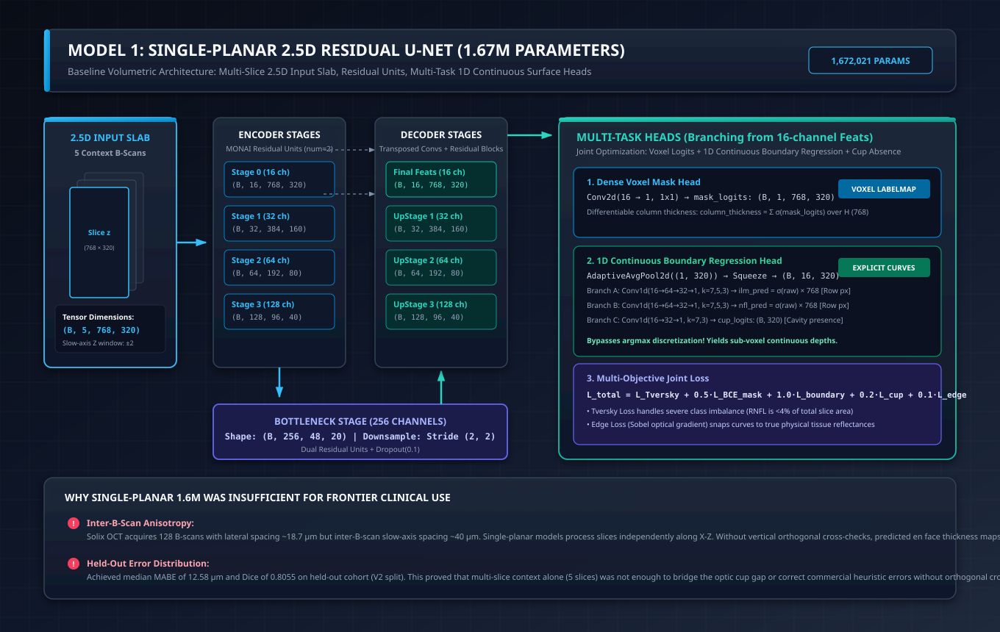

# Model 1: Single-Planar 2.5D Residual U-Net (1.67M Parameters)

**Implementation:** [`train-cnn-models/model_training/train_rnfl_volumetric/model.py`](file:///Users/nikhilmundhra/Documents/Github/Capstone/train-cnn-models/model_training/train_rnfl_volumetric/model.py#L71-L146)  
**Historical Evaluation Checkpoint:** Job `18043443` (Light Volumetric Baseline)  
**Architectural Paradigm:** 2.5D Multi-Slice Input, 2D Residual U-Net Backbone, Continuous 1D Boundary Regression Heads  
**Parameter Count:** **1,672,021 parameters (~1.67M)**

---

## 1. Architectural Blueprint & Tensor Dataflow



### 1.1 Input Geometry & 2.5D Context Window
Unlike conventional 2D slice-by-slice networks that process isolated B-scans with zero out-of-plane awareness, the **Single-Planar 2.5D Residual U-Net** feeds a continuous 5-slice slab centered around target slice $z$:
$$\mathbf{X}_z = [I_{z-2},\, I_{z-1},\, I_z,\, I_{z+1},\, I_{z+2}] \in \mathbb{R}^{B \times 5 \times 768 \times 320}$$
- **Axial Depth ($H=768$ rows):** Physical resolution $\Delta y \approx 3.9\,\mu\text{m}/\text{px}$. Preserved in its entirety without cropping to retain the full vitreoretinal and choroidal anatomical depth.
- **Fast Acquisition Lateral Axis ($W=320$ columns):** Physical resolution $\Delta x \approx 18.7\,\mu\text{m}/\text{px}$.
- **Out-of-Plane Context ($C_{\text{in}}=5$ channels):** Provides local 3D structural continuity along the slow acquisition axis ($\Delta z \approx 40\,\mu\text{m}/\text{scan}$) to disambiguate blood vessel shadows and speckle noise.

---

## 2. Backbone Architecture: High-Resolution Residual U-Net

The backbone leverages a MONAI 2D U-Net configured with **2 residual units per stage** (`num_res_units=2`), ensuring smooth gradient propagation and mitigating vanishing gradients across deep layer transitions:

```
Input Slab: (B, 5, 768, 320)
 │
 ├── Stage 0: 16 channels  → (B, 16, 768, 320)   [Stride 1, 2 Residual Units]
 ├── Stage 1: 32 channels  → (B, 32, 384, 160)   [Stride 2 Downsampling]
 ├── Stage 2: 64 channels  → (B, 64, 192, 80)    [Stride 2 Downsampling]
 ├── Stage 3: 128 channels → (B, 128, 96, 40)    [Stride 2 Downsampling]
 │
 └── Bottleneck: 256 ch    → (B, 256, 48, 20)    [Stride 2 Downsampling + Dropout(0.1)]
 │
 ├── UpStage 3: 128 ch     → (B, 128, 96, 40)    [Transposed Conv + Skip from Stage 3]
 ├── UpStage 2: 64 ch      → (B, 64, 192, 80)    [Transposed Conv + Skip from Stage 2]
 ├── UpStage 1: 32 ch      → (B, 32, 384, 160)   [Transposed Conv + Skip from Stage 1]
 └── UpStage 0: 16 ch      → (B, 16, 768, 320)   [Transposed Conv + Skip from Stage 0]
```

### Residual Unit Formulation
Each residual block computes:
$$\mathbf{y} = \mathbf{x} + \mathcal{F}(\mathbf{x}, \{W_i\}) = \mathbf{x} + \left[ \text{Conv}_{3 \times 3} \circ \text{BN} \circ \text{PReLU} \circ \text{Conv}_{3 \times 3} \circ \text{BN} \right](\mathbf{x})$$
The additive skip identity $\mathbf{x}$ allows features at full native axial resolution ($768$) to bypass spatial bottlenecks, preventing boundary softening.

---

## 3. Multi-Task Heads: Overcoming the Argmax Discretization Floor

A standard binary segmentation head outputs voxel probabilities $\mathbf{P} \in [0, 1]^{B \times 1 \times H \times W}$. In clinical practice, obtaining explicit boundary curves requires taking an `argmax` or threshold along each A-scan column:
$$\hat{y}_{\text{boundary}}(x) = \arg\max_y P(y, x)$$
This introduces an **irreducible integer discretization error** of at least $\pm 1\,\text{px} \approx \pm 3.9\,\mu\text{m}$, creating jagged stepping artifacts.

To solve this, the Single-Planar architecture introduces the **`BoundaryRegressionHead`** ([`model.py#L28-L69`](file:///Users/nikhilmundhra/Documents/Github/Capstone/train-cnn-models/model_training/train_rnfl_volumetric/model.py#L28-L69)):

```
Decoder Features (B, 16, 768, 320)
       │
       ▼
AdaptiveAvgPool2d((1, 320))
       │
       ▼ Squeeze(2)
Pooled Features: (B, 16, 320)
       ├── Conv1d(16→64→32→1, k=7,5,3) → ilm_pred = σ(ilm_raw) × 768.0  [Continuous Depth px]
       ├── Conv1d(16→64→32→1, k=7,5,3) → nfl_pred = σ(nfl_raw) × 768.0  [Continuous Depth px]
       └── Conv1d(16→32→1, k=7,3)       → cup_logits: (B, 320)           [Cavity Absence Logits]
```

### Differentiable Column Thickness
In addition to 1D boundary depths, the network derives a continuous column thickness integral directly from the dense mask logits:
$$T_{\text{col}}(x) = \sum_{y=0}^{767} \sigma\big(\text{mask\_logits}(y, x)\big) \in \mathbb{R}^{B \times 320}$$
This thickness curve is continuously differentiable and is directly constrained by the ground truth curve distance $(y_{\text{NFL}} - y_{\text{ILM}})$.

---

## 4. Benchmark Performance & Key Limitations

Evaluated on the frozen 20-subject held-out cohort (`stratified_held_out_v2.json`, 40 paired OD/OS scans):

| Metric | Single-Planar 1.6M (Job 18043443) | Commercial Solix Heuristic |
| :--- | :---: | :---: |
| **Parameters** | 1,672,021 | N/A |
| **Median RNFL Dice** | **0.8055** | 0.9233* |
| **Mean RNFL Dice $\pm$ SD** | 0.7662 $\pm$ 0.1114 | — |
| **Median MABE** | **12.58 $\mu\text{m}$** | 5.17 $\mu\text{m}$* |
| **Mean MABE $\pm$ SD** | 20.18 $\pm$ 19.52 $\mu\text{m}$ | — |
| **Median $P_{95}$ Error** | **32.96 $\mu\text{m}$** | 34.21 $\mu\text{m}$ |
| **Median Cup IoU** | **0.8422** | 0.8063 |

*\*Scored on the 10-eye human-audited tier where raw commercial curves required correction.*

### Why Single-Planar 1.6M Was Insufficient:
1. **Severe Inter-B-Scan Anisotropy:** Because processing is purely along horizontal $X$-$Z$ planes, there is no spatial enforcement of continuity across the slow $Y$-$Z$ plane. Reconstructed en face thickness maps showed horizontal stripe artifacts.
2. **Elevated Outlier Vulnerability:** Without orthogonal cross-checking, single-slice shadows caused the 1D regression heads to drift into deeper retinal layers (Mean MABE $20.18\,\mu\text{m}$).
3. **Paved the Way for Orthogonal Fusion:** This model proved that multi-task continuous boundary regression was mathematically viable, motivating the team's transition to **Bi-Planar Orthogonal Consensus Fusion**.
