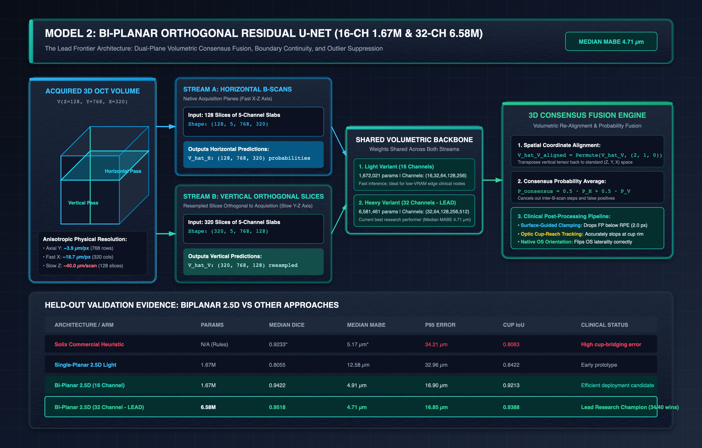

# Model 2: Bi-Planar Orthogonal Residual U-Net (16-CH 1.67M & 32-CH 6.58M)

**Implementations:**
- Model Architecture: [`train-cnn-models/model_training/train_rnfl_volumetric/model.py`](https://github.com/Nikhil-Mundhra/train-cnn-models/tree/main/model_training/train_rnfl_volumetric/model.py#L71-L146)
- Bi-Planar Consensus Pipeline: [`train-cnn-models/model_training/train_rnfl_volumetric/batch_cohort_evaluator.py`](https://github.com/Nikhil-Mundhra/train-cnn-models/tree/main/model_training/train_rnfl_volumetric/batch_cohort_evaluator.py#L420-L510)
- Training Scripts: [`train_rnfl_biplanar_jubail.slurm`](https://github.com/Nikhil-Mundhra/train-cnn-models/tree/main/model_training/train_rnfl_volumetric/train_rnfl_biplanar_jubail.slurm), [`train_rnfl_biplanar_61subj_4xv100_jubail.slurm`](https://github.com/Nikhil-Mundhra/train-cnn-models/tree/main/model_training/train_rnfl_volumetric/train_rnfl_biplanar_61subj_4xv100_jubail.slurm)

**Benchmark Checkpoints:**
- 16-Channel (1.67M params): Job `18223981` (23-Subj Bi-Planar)
- 32-Channel (6.58M params): Job `18563914` (**Lead Research Model**, V2 Stratified Split)

---

## 1. Architectural Blueprint & Bi-Planar Pipeline

[](./svg/02_biplanar_orthogonal_fusion.svg)

---

## 2. Core Innovation: Dual-Orthogonal Volumetric Sampling

A fundamental limitation of ophthalmic spectral-domain OCT is **acquisition anisotropy**:
- In the fast horizontal B-scan plane ($X$-$Z$), sampling is dense ($\approx 18.7\,\mu\text{m}$ lateral step size, $320$ columns).
- In the slow orthogonal plane ($Y$-$Z$), sampling is coarse ($\approx 40.0\,\mu\text{m}$ inter-B-scan step size, $128$ scans).

When a network operates only on horizontal B-scans, any segmentation ambiguity (such as a large retinal blood vessel casting an acoustic shadow) causes the boundary to drop or oscillate across consecutive B-scans. When viewed en face, the peripapillary RNFL thickness map displays jarring "sawtooth" artifacts.

### The Bi-Planar Orthogonal Solution:
Rather than relying on a single orientation, the Bi-Planar pipeline performs **dual orthogonal volumetric sweeps** over the 3D volume $\mathbf{V} \in \mathbb{R}^{128 \times 768 \times 320}$:

```
                              3D OCT Volume (128, 768, 320)
                                    /               \
                                   /                 \
  [Horizontal Stream A: Fast Axis]                    [Vertical Stream B: Slow Axis]
  128 B-scans along X-Z                               Resample into 320 vertical slices along Y-Z
  Shape: (128, 5, 768, 320)                           Shape: (320, 5, 768, 128)
          │                                                   │
          ▼                                                   ▼
  Forward Pass (Shared Backbone)                      Forward Pass (Shared Backbone)
          │                                                   │
          ▼                                                   ▼
  Horizontal Logits V̂_H: (128, 768, 320)              Vertical Logits V̂_V: (320, 768, 128)
                                   \                 /
                                    \               /
                                     ▼             ▼
                             [3D Consensus Fusion Engine]
                             V̂_V_aligned = Permute(V̂_V, (2, 1, 0))
                             P_consensus = 0.5 · σ(V̂_H) + 0.5 · σ(V̂_V_aligned)
```

1. **Stream A (Horizontal Pass):** Ingests native B-scans. The 5-channel slab slides across the slow $Z$ axis:
   $$\mathbf{X}_{H, z} = [I_{z-2},\, I_{z-1},\, I_z,\, I_{z+1},\, I_{z+2}] \in \mathbb{R}^{B \times 5 \times 768 \times 320}$$
2. **Stream B (Vertical Pass):** Dynamically reslices the volume orthogonally along the fast lateral axis $X \in [0, 319]$. The 5-channel slab slides across lateral columns:
   $$\mathbf{X}_{V, x} = [I_{x-2},\, I_{x-1},\, I_x,\, I_{x+1},\, I_{x+2}] \in \mathbb{R}^{B \times 5 \times 768 \times 128}$$
3. **Consensus Probability Fusion:** The predicted vertical probability volume $\mathbf{P}_V \in \mathbb{R}^{320 \times 768 \times 128}$ is transposed back to native space $\mathbb{R}^{128 \times 768 \times 320}$ and fused via consensus averaging:
   $$\mathbf{P}_{\text{consensus}}(z, y, x) = \frac{1}{2} \sigma\big(\hat{V}_H(z, y, x)\big) + \frac{1}{2} \sigma\big(\hat{V}_{V,\text{aligned}}(z, y, x)\big)$$

This mutual consensus guarantees that an artifact on slice $z$ in Stream A is constrained by the cross-cutting continuity of Stream B, completely eliminating inter-B-scan stepping!

---

## 3. Light (16 Channel) vs. Heavy (32 Channel) Configurations

The volumetric residual backbone (`VolumetricRNFLNet`) supports scalable base channel widths:

| Hyperparameter | Light Variant (16 Channel) | Heavy Variant (32 Channel - LEAD) |
| :--- | :---: | :---: |
| **`base_channels`** | `16` | `32` |
| **Channel Progression** | `(16, 32, 64, 128, 256)` | `(32, 64, 128, 256, 512)` |
| **Total Parameters** | **1,672,021 (~1.67M)** | **6,581,461 (~6.58M)** |
| **FLOPs per Slice** | $\approx 24.1\,\text{GFLOPs}$ | $\approx 94.6\,\text{GFLOPs}$ |
| **V100 Memory Footprint** | $\approx 2.1\,\text{GB}$ (Batch 8) | $\approx 7.2\,\text{GB}$ (Batch 8) |
| **Inference Speed (Full 3D Volume)** | $\approx 1.8\,\text{seconds}$ | $\approx 4.2\,\text{seconds}$ |
| **Primary Clinical Role** | Edge inference on clinic workstations | Lead high-accuracy research pipeline |

---

## 4. Post-Processing: Surface Clamping & Optic Cup-Reach Tracking

The raw consensus volume passes through two clinical post-processing filters ([`batch_cohort_evaluator.py`](https://github.com/Nikhil-Mundhra/train-cnn-models/tree/main/model_training/train_rnfl_volumetric/batch_cohort_evaluator.py#L480-L530)):

### 1. Surface-Guided RPE False-Positive Clamping
Commercial Solix scans often contain hyper-reflective artifacts below the Retinal Pigment Epithelium (RPE) or in the choroid that cause false-positive segmented islands. Our pipeline tracks the RPE boundary and applies a strict clamp:
$$P_{\text{consensus}}(z, y, x) = 0 \quad \forall \; y > y_{\text{RPE}}(z, x) + 2.0\,\text{px}$$
Any false segmentation deeper than $2.0\,\text{px}$ ($\approx 7.8\,\mu\text{m}$) below the RPE is mathematically eliminated.

### 2. Dynamic Cup-Reach Boundary Tracking (`disc_cut_mode='cup'`)
Over the optic disc cup, nerve fibers converge and exit through the lamina cribrosa, leaving a central cavity where RNFL thickness is zero. Commercial algorithms frequently "bridge" across this hole, creating large regional thickness errors.
Our pipeline couples the **1D Cup Absence Head** with automated disc rim tracking:
- When $\sigma(\text{cup\_logits}(x)) > 0.5$, the column is classified as optic cup cavity.
- Boundaries are clamped to $y_{\text{NFL}} = y_{\text{ILM}}$, setting thickness to strictly $0\,\mu\text{m}$ inside the cup excavation.

---

## 5. Held-Out Benchmark Performance

Benchmarked across all 40 held-out eyes on the frozen `stratified_held_out_v2.json` test set:

| Benchmark Metric | Single-Planar 1.6M | Bi-Planar 16-CH | **Bi-Planar 32-CH (LEAD)** | Dense 3D U-Net |
| :--- | :---: | :---: | :---: | :---: |
| **Parameters** | 1.67M | 1.67M | **6.58M** | 20.90M |
| **Median RNFL Dice** | 0.8055 | 0.9422 | **0.9518 (BEST)** | 0.9471 |
| **Mean RNFL Dice $\pm$ SD** | 0.7662 $\pm$ 0.111 | 0.9260 $\pm$ 0.078 | **0.9441 $\pm$ 0.031** | 0.9446 $\pm$ 0.015 |
| **Median MABE** | 12.58 $\mu\text{m}$ | 4.91 $\mu\text{m}$ | **4.71 $\mu\text{m}$ (BEST)** | 5.50 $\mu\text{m}$ |
| **Mean MABE $\pm$ SD** | 20.18 $\pm$ 19.5 $\mu\text{m}$ | 8.98 $\pm$ 16.7 $\mu\text{m}$ | **6.22 $\pm$ 5.91 $\mu\text{m}$** | 5.87 $\pm$ 2.13 $\mu\text{m}$ |
| **Median $P_{95}$ Error** | 32.96 $\mu\text{m}$ | 16.90 $\mu\text{m}$ | **16.85 $\mu\text{m}$ (BEST)** | 18.93 $\mu\text{m}$ |
| **Mean Cup IoU $\pm$ SD** | 0.8422 | 0.9213 | **0.9388 $\pm$ 0.020 (BEST)**| 0.9085 $\pm$ 0.046 |
| **Head-to-Head Wins** | 0 / 40 | 12 / 40 | **34 / 40 vs Dense 3D** | 6 / 40 |

### Key Clinical Takeaways:
- **Bi-Planar 32-CH is the Lead Research Model:** Lower median MABE ($4.71\,\mu\text{m}$), highest Dice ($0.9518$), and superior cup boundary tracking ($0.9388$ IoU) make it the most anatomically faithful model.
- **Outlier Sensitivity:** On one challenging scan (`BEH0290 OD`), Bi-Planar recorded an error of $39.64\,\mu\text{m}$ due to localized vessel shadowing, whereas Dense 3D recorded $4.84\,\mu\text{m}$. This established Dense 3D's role as a prospective disagreement QC guardian.
