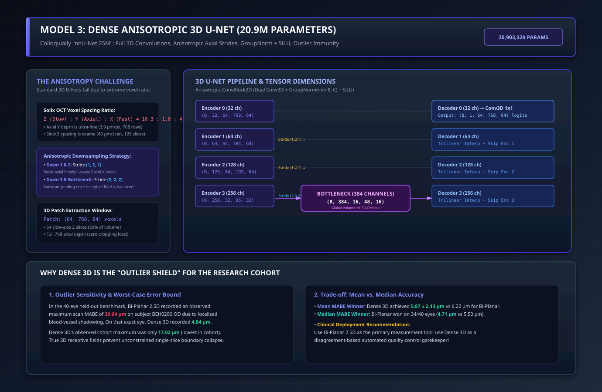

# Model 3: Dense Anisotropic 3D U-Net (20.9M Parameters)

**Implementation:** [`train-cnn-models/model_training/train_rnfl_3d/model_3d.py`](file:///Users/nikhilmundhra/Documents/Github/Capstone/train-cnn-models/model_training/train_rnfl_3d/model_3d.py)  
**Historical Evaluation Checkpoint:** Job `18574378`  
**Architectural Paradigm:** Fully 3D Convolutional Network, Anisotropic Patch-Based Slicing, GroupNorm + SiLU Activations  
**Parameter Count:** **20,903,329 parameters (~20.9M)** *(colloquially referred to as "Dense 3D nnU-Net 25M ish")*

---

## 1. Architectural Blueprint & 3D Tensor Dataflow



---

## 2. Clarifying the Nomenclature: Custom Anisotropic 3D vs. nnU-Net

In project discussions, this model is frequently referred to as **"Dense 3D nnU-Net 25M"**. Technically, it is **not an off-the-shelf nnU-Net framework execution** (which uses automatic heuristic hyperparameter generation and deep supervision).

Instead, it is a **custom-engineered Dense Anisotropic 3D U-Net** (`AnisotropicRNFLUNet3D` in [`model_3d.py`](file:///Users/nikhilmundhra/Documents/Github/Capstone/train-cnn-models/model_training/train_rnfl_3d/model_3d.py#L63-L99)), designed specifically for the extreme voxel anisotropy of the Optovue Solix scanner:
- **True 3D Convolutions:** Kernels are $3 \times 3 \times 3$, maintaining continuous spatial receptive fields across slow ($Z$), axial ($Y$), and lateral ($X$) dimensions simultaneously.
- **Group Normalization:** Replaces BatchNorm with GroupNorm (`num_groups = min(8, out_channels)`), enabling stable gradient statistics even with micro-batch sizes ($B=1$ or $2$ per GPU) under high 3D VRAM demands.
- **SiLU (Swish) Activations:** Replaces standard ReLU to maintain non-zero gradients for small negative pre-activations, preserving subtle contrast variations in hyporeflective layers.

---

## 3. Resolving the Severe Voxel Anisotropy Challenge

A naive 3D U-Net applies isotropic downsampling ($2 \times 2 \times 2$ pooling at every stage). On Optovue Solix OCT, this causes catastrophic boundary degradation:
- **Axial Depth ($Y$):** $768$ rows with physical spacing $\approx 3.9\,\mu\text{m}/\text{px}$.
- **Lateral Fast Axis ($X$):** $320$ columns with physical spacing $\approx 18.7\,\mu\text{m}/\text{px}$.
- **Slow Acquisition Axis ($Z$):** $128$ scans with physical spacing $\approx 40.0\,\mu\text{m}/\text{scan}$.

The physical spacing ratio is:
$$\Delta z : \Delta y : \Delta x \approx 10.3 : 1.0 : 4.8$$
Pooling along $Z$ immediately merges distinct anatomical scans separated by $40\,\mu\text{m}$, while pooling along $Y$ destroys the $3.9\,\mu\text{m}$ boundaries of thin retinal layers.

### The Decoupled Anisotropic Downsampling Strategy
To solve this, `AnisotropicRNFLUNet3D` uses **non-isotropic downsampling strides** across its encoder stages ([`model_3d.py#L17-L23`](file:///Users/nikhilmundhra/Documents/Github/Capstone/train-cnn-models/model_training/train_rnfl_3d/model_3d.py#L17-L23)):

```
Input 3D Patch: (B, 1, 64, 768, 64)  [Slow Z, Axial Y, Fast X]
 │
 ├── Encoder 0: 32 ch  → (B, 32, 64, 768, 64)   [ConvBlock3D, Stride 1]
 ├── Encoder 1: 64 ch  → (B, 64, 64, 384, 64)   [Stride (1, 2, 1) - Axial Pool ONLY!]
 ├── Encoder 2: 128 ch → (B, 128, 64, 192, 64)  [Stride (1, 2, 1) - Axial Pool ONLY!]
 ├── Encoder 3: 256 ch → (B, 256, 32, 96, 32)   [Stride (2, 2, 2) - Isotropic Pool]
 │
 └── Bottleneck: 384 ch→ (B, 384, 16, 48, 16)   [Stride (2, 2, 2) - Isotropic Pool]
 │
 ├── Decoder 3: 256 ch → (B, 256, 32, 96, 32)   [Trilinear Interp + 3D Skip from Enc 3]
 ├── Decoder 2: 128 ch → (B, 128, 64, 192, 64)  [Trilinear Interp + 3D Skip from Enc 2]
 ├── Decoder 1: 64 ch  → (B, 64, 64, 384, 64)   [Trilinear Interp + 3D Skip from Enc 1]
 └── Decoder 0: 32 ch  → (B, 32, 64, 768, 64)   [Trilinear Interp + 3D Skip from Enc 0]
 │
 └── Mask Head: Conv3D(32 → 1, 1x1x1) → (B, 1, 64, 768, 64) Logits
```

1. **Stages 1 & 2:** Stride is strictly `(1, 2, 1)`. Downsampling occurs exclusively along the axial depth ($Y$), preserving the coarse slow axis ($Z=64$) and fast axis ($X=64$) until the physical receptive field reaches isotropic equivalence.
2. **Stages 3 & Bottleneck:** Once axial depth is compressed to $192$ rows, downsampling transitions to isotropic `(2, 2, 2)` strides to capture global peripapillary optic cup context.
3. **Zero Axial Cropping:** Operates on full $768$-row axial patches, ensuring no clipping of high-positioned or tilted retinas.

---

## 4. Benchmark Findings: The "Outlier Shield" for the Cohort

Evaluated against the frozen 40-eye held-out validation cohort (`stratified_held_out_v2.json`):

| Performance Metric | Bi-Planar 2.5D (6.58M) | Dense 3D U-Net (20.9M) | TransUNet (5.1M) |
| :--- | :---: | :---: | :---: |
| **Parameters** | 6.58M | **20.90M** | 5.10M |
| **Median RNFL Dice** | **0.9518** | 0.9471 | 0.6922 |
| **Mean RNFL Dice $\pm$ SD** | 0.9441 $\pm$ 0.0309 | **0.9446 $\pm$ 0.0152 (BEST)**| 0.6435 $\pm$ 0.1480 |
| **Median MABE** | **4.71 $\mu\text{m}$ (BEST)** | 5.50 $\mu\text{m}$ | 31.90 $\mu\text{m}$ |
| **Mean MABE $\pm$ SD** | 6.22 $\pm$ 5.91 $\mu\text{m}$ | **5.87 $\pm$ 2.13 $\mu\text{m}$ (BEST)**| 42.69 $\pm$ 33.00 $\mu\text{m}$ |
| **Median $P_{95}$ Error** | **16.85 $\mu\text{m}$** | 18.93 $\mu\text{m}$ | 86.47 $\mu\text{m}$ |
| **Observed Maximum MABE** | 39.64 $\mu\text{m}$ | **17.02 $\mu\text{m}$ (LOWEST)**| 216.55 $\mu\text{m}$ |
| **Error Standard Deviation** | $\sigma = 5.91\,\mu\text{m}$ | **$\sigma = 2.13\,\mu\text{m}$ (TIGHTEST)**| $\sigma = 33.00\,\mu\text{m}$ |

---

## 5. Clinical Analysis: Median vs. Mean Trade-off

The benchmark revealed a critical distinction between **Bi-Planar 2.5D** and **Dense 3D U-Net**:

1. **Bi-Planar has Superior Typical Accuracy:** On 34 out of 40 held-out eyes, Bi-Planar recorded lower MABE than Dense 3D (Median $4.71\,\mu\text{m}$ vs $5.50\,\mu\text{m}$). In typical scans, Bi-Planar's continuous 1D boundary regression heads yield tighter physical fit.
2. **Dense 3D Has Unmatched Worst-Case Resilience:**
   - On subject `BEH0290 OD`, Bi-Planar suffered from severe acoustic shadowing, recording an outlier error of $39.64\,\mu\text{m}$.
   - On that exact same scan, **Dense 3D achieved $4.84\,\mu\text{m}$**, completely unperturbed by the single-slice shadow.
   - Dense 3D's observed maximum error across the entire cohort was only **$17.02\,\mu\text{m}$** (less than half of Bi-Planar's worst case).
3. **Standard Deviation:** Dense 3D's error distribution has a sample standard deviation of just **$\pm 2.13\,\mu\text{m}$** (vs $\pm 5.91\,\mu\text{m}$ for Bi-Planar), demonstrating rock-solid clinical predictability.

### Proposed Clinical Deployment Strategy:
> [!TIP]
> **Dual-Model Disagreement QC Gatekeeper:**
> Run **Bi-Planar 32-CH** as the primary diagnostic segmentation tool for maximum precision ($4.71\,\mu\text{m}$ median error). Concurrently run **Dense 3D U-Net** in the background. If the absolute difference $|\text{MABE}_{\text{BiPlanar}} - \text{MABE}_{\text{3D}}| > 10\,\mu\text{m}$, flag the scan for automated clinician manual review.
