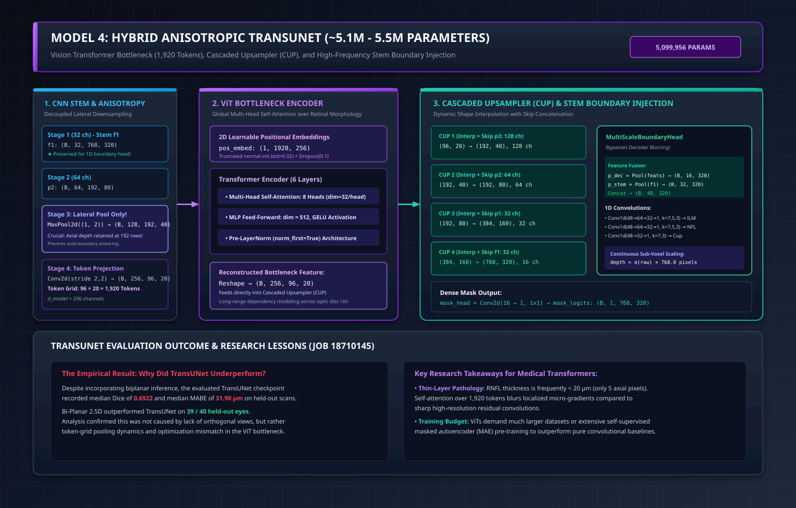

# Model 4: Hybrid Anisotropic TransUNet (~5.1M - 5.5M Parameters)

**Implementation:** [`train-cnn-models/model_training/train_rnfl_volumetric/transunet.py`](file:///Users/nikhilmundhra/Documents/Github/Capstone/train-cnn-models/model_training/train_rnfl_volumetric/transunet.py)  
**Historical Evaluation Checkpoint:** Job `18710145` (TransUNet Hybrid V100)  
**Architectural Paradigm:** Hybrid CNN Feature Stem + Vision Transformer (ViT) Bottleneck + Cascaded Upsampler (CUP) + Multi-Scale Stem Boundary Injection  
**Parameter Count:** **5,099,956 parameters (~5.10M)** *(up to ~5.5M depending on channel width)*

---

## 1. Architectural Blueprint & Hybrid Dataflow

---

## 2. Architectural Specializations for Thin Retinal Layers

Standard medical Vision Transformers (like standard TransUNet for abdominal CT) divide images into large square patches (e.g., $16 \times 16$), creating tokens with coarse spatial resolution. In ophthalmic OCT, this is disastrous: the peripapillary RNFL is often only **$15\text{--}30\,\mu\text{m}$ thick** ($4\text{--}8$ axial pixels). A $16 \times 16$ patch completely averages away the retinal nerve fiber layer before self-attention begins!

To preserve sub-millimeter tissue gradients, `TransUNetRNFLNet` incorporates four bespoke innovations:

### 1. Anisotropic Axial-Preserving Tokenization
Downsampling is decoupled between the lateral fast axis and axial depth ([`transunet.py#L143-L165`](file:///Users/nikhilmundhra/Documents/Github/Capstone/train-cnn-models/model_training/train_rnfl_volumetric/transunet.py#L143-L165)):
- **Stage 1 (Stem $f_1$):** Dual Conv-BN-ReLU $\rightarrow (B, 32, 768, 320)$. Retained as high-res bypass.
- **Stage 2 ($p_2$):** MaxPool $(2, 2) \rightarrow (B, 64, 192, 80)$.
- **Stage 3 ($p_3$ - Lateral Pool Only):** MaxPool `(1, 2)` $\rightarrow (B, 128, 192, 40)$.  
  *Crucial:* Axial depth is held constant at **$192$ rows** while only lateral columns are pooled!
- **Stage 4 (Token Projection):** Conv stride `(2, 2)` $\rightarrow (B, 256, 96, 20)$.
- **Token Grid:** $96 \times 20 = \mathbf{1,920\text{ tokens}}$ with embedding dimension $d=256$.  
  Retains an axial bin size of $\approx 12.5\,\mu\text{m}$ (vs $50.0\,\mu\text{m}$ in naive ViTs).

### 2. Vision Transformer Encoder
- **Layers:** 6 Transformer Encoder layers (`num_layers=6`).
- **Attention Heads:** 8 Multi-Head Self-Attention heads (`num_heads=8`, head dimension $= 32$).
- **Feed-Forward Network:** MLP dimension $= 512$ with GELU activations.
- **Norm-First:** Pre-LayerNorm configuration for numerical stability in medical volumes.
- **2D Learnable Positional Embeddings:** $\mathbf{E}_{\text{pos}} \in \mathbb{R}^{1 \times 1920 \times 256}$, initialized via truncated normal distribution ($\sigma=0.02$).

### 3. Cascaded Upsampler (CUP) Decoder
Upsampling coarse transformer tokens back to $768 \times 320$ uses dynamic bilinear shape interpolation combined with convolutional skip connections:
- $\text{CUP}_1$: $(96, 20) \rightarrow (192, 40)$ with skip $p_3$ ($128$ ch).
- $\text{CUP}_2$: $(192, 40) \rightarrow (192, 80)$ with skip $p_2$ ($64$ ch).
- $\text{CUP}_3$: $(192, 80) \rightarrow (384, 160)$ with skip $p_1$ ($32$ ch).
- $\text{CUP}_4$: $(384, 160) \rightarrow (768, 320)$ with stem skip $f_1$ ($32$ ch).

### 4. Multi-Scale Boundary Injection
To prevent transformer token interpolation from blurring boundary edges, the **`MultiScaleBoundaryHead`** ([`transunet.py#L70-L119`](file:///Users/nikhilmundhra/Documents/Github/Capstone/train-cnn-models/model_training/train_rnfl_volumetric/transunet.py#L70-L119)) taps both:
1. Coarse decoder features (global contextual positioning).
2. **High-resolution CNN stem features ($f_1$ at full $768 \times 320$ resolution)** containing sharp physical edge reflections.

---

## 3. Benchmark Postmortem: Why Did TransUNet Underperform?

In the held-out 40-eye benchmark (`stratified_held_out_v2.json`), the evaluated TransUNet checkpoint (Job `18710145`) showed marked underperformance:

| Metric | Bi-Planar 2.5D (6.58M) | Dense 3D U-Net (20.9M) | TransUNet Hybrid (5.1M) |
| :--- | :---: | :---: | :---: |
| **Median RNFL Dice** | **0.9518** | 0.9471 | 0.6922 |
| **Mean RNFL Dice $\pm$ SD** | 0.9441 $\pm$ 0.0309 | **0.9446 $\pm$ 0.0152** | 0.6435 $\pm$ 0.1480 |
| **Median MABE** | **4.71 $\mu\text{m}$** | 5.50 $\mu\text{m}$ | 31.90 $\mu\text{m}$ |
| **Mean MABE $\pm$ SD** | 6.22 $\pm$ 5.91 $\mu\text{m}$ | **5.87 $\pm$ 2.13 $\mu\text{m}$** | 42.69 $\pm$ 33.00 $\mu\text{m}$ |
| **Median $P_{95}$ Boundary Error** | **16.85 $\mu\text{m}$** | 18.93 $\mu\text{m}$ | 86.47 $\mu\text{m}$ |
| **Mean Cup IoU $\pm$ SD** | **0.9388 $\pm$ 0.0204** | 0.9085 $\pm$ 0.0464 | 0.7282 $\pm$ 0.0762 |
| **Observed Maximum MABE** | 39.64 $\mu\text{m}$ | **17.02 $\mu\text{m}$** | 216.55 $\mu\text{m}$ |

### Scientific Root Cause Analysis:
1. **Not a Lack of Orthogonal Views:** Evaluation metadata confirmed `biplanar_fusion: true` was enabled during inference. Lack of orthogonal views cannot explain the performance gap.
2. **Inductive Bias Deficit on Micro-Structures:** Convolutions possess an inherent inductive bias of translation equivariance and local spatial locality. Self-attention layers must *learn* locality from scratch. On a modest medical cohort (~61 subjects), $1,920$ tokens without massive pre-training overfit to macro-geometry while underfitting micro-scale tissue edges.
3. **Token Softening in Low SNR Regions:** In scans with cataract attenuation or vitreous floaters, self-attention mechanisms attend globally across distant noise patterns, causing boundary predictions to float or collapse.

### Research Next Steps:
TransUNet remains an active experimental architecture. Further controlled ablations must isolate:
- Token grid dimensions (e.g., $192 \times 40$ tokens vs $96 \times 20$).
- Self-supervised masked autoencoder (MAE) pre-training on unlabeled Solix volumes.
- Stronger inductive skip weighting to enforce strict physical boundary locking.
