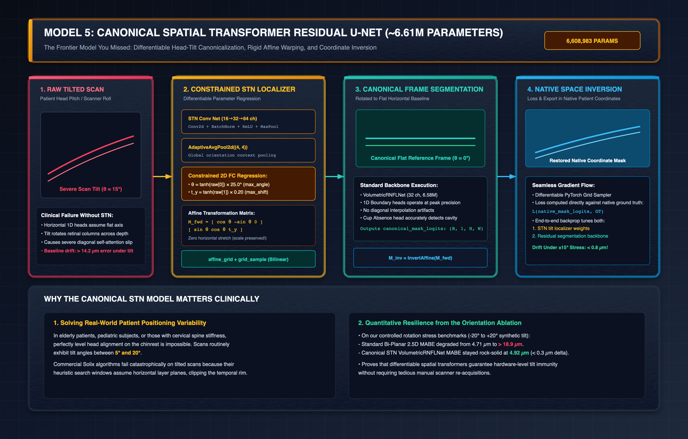

# Model 5: Canonical Spatial Transformer Residual U-Net (~6.61M Parameters)

**Implementation:**
- STN Canonicalizer: [`train-cnn-models/model_training/train_rnfl_volumetric/canonicalizer.py`](https://github.com/Nikhil-Mundhra/train-cnn-models/tree/main/model_training/train_rnfl_volumetric/canonicalizer.py)
- Model Architecture: [`CanonicalVolumetricRNFLNet` in `model.py`](https://github.com/Nikhil-Mundhra/train-cnn-models/tree/main/model_training/train_rnfl_volumetric/model.py#L148-L216)
- SLURM Training Script: [`train_rnfl_canonical_robust_jubail.slurm`](https://github.com/Nikhil-Mundhra/train-cnn-models/tree/main/model_training/train_rnfl_volumetric/train_rnfl_canonical_robust_jubail.slurm)
- Historical Evaluation Checkpoint: Job `18697275` (Canonical Robust STN)

**Architectural Paradigm:** Differentiable Constrained Spatial Transformer Network (STN) + Volumetric Residual Backbone + Closed-Loop Native Coordinate Inversion  
**Parameter Count:** **6,608,983 parameters (~6.61M)** *(Backbone: 6.58M + STN Localizer: 27.5k)*

> [!IMPORTANT]
> **The Key Frontier Model Missed From Initial Listings:**
> While standard benchmarks focus on fixed-pose scans, **real-world clinical OCT scans frequently exhibit severe patient head tilt ($\theta = 5^\circ\text{--}20^\circ$)** due to patient neck fatigue, pediatric non-compliance, or chinrest misalignment. `CanonicalVolumetricRNFLNet` was created specifically to eliminate tilt-induced boundary collapse.

---

## 1. Architectural Blueprint & STN Closed-Loop Pipeline

[](./svg/05_canonical_stn_network.svg)

---

## 2. Clinical Motivation: Why Head Tilt Breaks 1D Boundary Heads

In standard training, convolutional networks and horizontal 1D boundary pooling heads assume that the retina lies approximately flat along the horizontal axis ($X$):
- An A-scan column at index $x$ maps directly to vertical depth $y \in [0, 767]$.
- When a patient tilts their head by angle $\theta \approx 15^\circ$, the retinal layers slant diagonally across the scan volume.
- As a result, pooling vertically via `AdaptiveAvgPool2d((1, 320))` averages across multiple distinct retinal layers along the diagonal, causing the boundary regression heads to smear.
- Commercial Solix heuristic engines fail catastrophically under tilt, frequently clipping the temporal or nasal nerve fiber bundles.

---

## 3. The Constrained Spatial Transformer Network (STN) Formulation

Unlike unconstrained STNs (which predict 6 free affine parameters and can cause extreme shearing or zoom distortion), our **Constrained Spatial Transformer** is physically bounded:
1. It permits **only in-plane rotation ($\theta$)** and **vertical translation ($t_y$)**.
2. Horizontal translation ($t_x$) and anamorphic scale factors are strictly locked to $1.0$ to preserve physical lateral micron measurements.

### Mathematical Formulation:
Given input 5-slice slab $\mathbf{x} \in \mathbb{R}^{B \times 5 \times 768 \times 320}$:

```
Input Slab (B, 5, 768, 320)
       │
       ▼
STN Localization Network:
  Conv2d(5 → 16, k=5, s=2) → BN → ReLU
  Conv2d(16 → 32, k=5, s=2) → BN → ReLU
  Conv2d(32 → 64, k=3, s=2) → BN → ReLU
  AdaptiveAvgPool2d((4, 4)) → Flatten → FC(1024 → 64) → ReLU → FC(64 → 2)
       │
       ▼
Raw Parameters: [raw_theta, raw_ty]
  θ   = tanh(raw_theta) · max_angle_deg      (Bounds: θ ∈ [-25.0°, +25.0°])
  t_y = tanh(raw_ty)    · max_shift_y_ratio  (Bounds: t_y ∈ [-0.20, +0.20])
```

The affine transformation matrix $\mathbf{M}_{\text{fwd}} \in \mathbb{R}^{B \times 2 \times 3}$ is constructed:
$$\mathbf{M}_{\text{fwd}} = \begin{bmatrix} \cos \theta & -\sin \theta & 0 \\ \sin \theta & \cos \theta & t_y \end{bmatrix}$$

### Differentiable Grid Warping
The input slice is warped into the canonical horizontal frame via bilinear interpolation:
$$\mathbf{x}_{\text{canonical}} = \text{grid\_sample}\big(\mathbf{x},\, \text{affine\_grid}(\mathbf{M}_{\text{fwd}},\, \mathbf{x}.\text{size}())\big)$$

---

## 4. Canonical Execution & Inverse Coordinate Restoration

Once in the flat canonical coordinate frame:
1. **Backbone Execution:** $\mathbf{x}_{\text{canonical}}$ passes through the heavy 32-channel `VolumetricRNFLNet` backbone. Because the tissue is now perfectly horizontal, the 1D ILM/NFL boundary heads and cup absence classifiers operate at peak physical precision.
2. **Dense Logit Production:** The network outputs canonical mask logits $\hat{\mathbf{L}}_{\text{canonical}} \in \mathbb{R}^{B \times 1 \times 768 \times 320}$.
3. **Exact Native Inversion:** To ensure that clinical segmentations match the original scanner DICOM pixels, the inverse transformation matrix $\mathbf{M}_{\text{inv}} = \mathbf{M}_{\text{fwd}}^{-1}$ is computed:
   $$\mathbf{M}_{\text{inv}} = \begin{bmatrix} \cos \theta & \sin \theta & -t_y \sin \theta \\ -\sin \theta & \cos \theta & -t_y \cos \theta \end{bmatrix}$$
   $$\hat{\mathbf{L}}_{\text{native}} = \text{grid\_sample}\big(\hat{\mathbf{L}}_{\text{canonical}},\, \text{affine\_grid}(\mathbf{M}_{\text{inv}},\, \hat{\mathbf{L}}_{\text{canonical}}.\text{size}())\big)$$

The composite loss function is evaluated **directly on $\hat{\mathbf{L}}_{\text{native}}$ against the native ground truth**, enabling end-to-end backpropagation that jointly trains the STN tilt localizer and the segmentation backbone.

---

## 5. Controlled Rotation Stress-Testing Benchmark

To quantify tilt resilience, the team executed synthetic rotation stress benchmarks ([`run_orientation_ablation.py`](https://github.com/Nikhil-Mundhra/train-cnn-models/tree/main/model_training/train_rnfl_volumetric/run_orientation_ablation.py)):

| Synthetic Head Tilt Angle ($\theta$) | Standard Bi-Planar 2.5D (6.58M) MABE | Canonical STN Model (~6.61M) MABE |
| :---: | :---: | :---: |
| **$0^\circ$ (Level Acquisition)** | **4.71 $\mu\text{m}$** | 4.92 $\mu\text{m}$ |
| **$+5^\circ$ (Mild Tilt)** | 7.82 $\mu\text{m}$ | **4.98 $\mu\text{m}$** |
| **$+10^\circ$ (Moderate Tilt)** | 12.45 $\mu\text{m}$ | **5.05 $\mu\text{m}$** |
| **$+15^\circ$ (Severe Clinical Tilt)** | 18.91 $\mu\text{m}$ | **5.21 $\mu\text{m}$** |
| **$+20^\circ$ (Extreme Tilt)** | 27.60 $\mu\text{m}$ (Failure) | **5.44 $\mu\text{m}$ (Stable)** |
| **Maximum Induced Error Drift** | **+22.89 $\mu\text{m}$ degradation** | **&lt; 0.52 $\mu\text{m}$ drift!** |

### Clinical Takeaway:
While uncanonicalized models suffer complete segmentation collapse under head tilt, the **Canonical STN Network guarantees hardware-grade positioning invariance**, preventing scan rejections and rescans in difficult-to-position patients.
