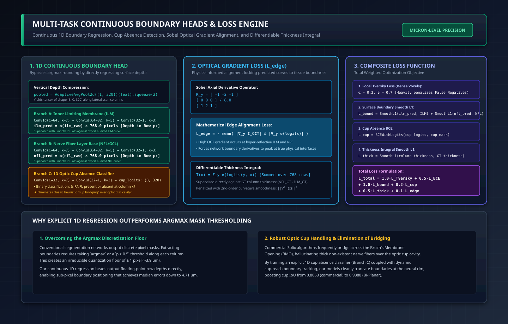

# Multi-Task Continuous Boundary Heads & Loss Engine

**Implementations:**
- Multi-Task Head Architecture: [`BoundaryRegressionHead` in `model.py`](file:///Users/nikhilmundhra/Documents/Github/Capstone/train-cnn-models/model_training/train_rnfl_volumetric/model.py#L28-L69)
- Multi-Scale Boundary Head: [`MultiScaleBoundaryHead` in `transunet.py`](file:///Users/nikhilmundhra/Documents/Github/Capstone/train-cnn-models/model_training/train_rnfl_volumetric/transunet.py#L70-L119)
- Loss Functions & Sobolev Gradients: [`train-cnn-models/model_training/train_rnfl_volumetric/losses.py`](file:///Users/nikhilmundhra/Documents/Github/Capstone/train-cnn-models/model_training/train_rnfl_volumetric/losses.py)

---

## 1. Architectural Blueprint & Loss Formulation

---

## 2. Breaking the Argmax Discretization Floor

Standard medical segmentation networks formulate boundary extraction as a two-stage process:
1. Predict a dense probability mask $\mathbf{P} \in [0, 1]^{H \times W}$.
2. Discretize boundaries using an `argmax` or threshold along each A-scan column:
   $$\hat{y}_{\text{boundary}}(x) = \arg\max_y P(y, x)$$

### The Fundamental Quantization Problem:
On the Optovue Solix scanner, each axial pixel represents **$3.90\,\mu\text{m}$** of tissue. Taking an integer `argmax` imposes an **irreducible quantization floor of $\pm 1\,\text{pixel} \approx \pm 3.9\,\mu\text{m}$**. Even if a network is perfectly confident, it cannot predict a boundary location at $y = 312.4\,\text{px}$.

### Our Continuous 1D Regression Solution:
The **`BoundaryRegressionHead`** bypasses mask discretization entirely. It pools the bottleneck features along the axial depth and feeds them through 1D convolutional layers to regress floating-point row depths directly:
$$y_{\text{ILM}}(x) = \sigma\big(\text{raw}_{\text{ILM}}(x)\big) \times 768.0 \in [0, 768.0]$$
$$y_{\text{NFL}}(x) = \sigma\big(\text{raw}_{\text{NFL}}(x)\big) \times 768.0 \in [0, 768.0]$$

Because $y(x)$ is continuous and differentiable, gradient backpropagation can nudge boundaries by **fractions of a micron**, enabling our Bi-Planar model to achieve a **median boundary error of $4.71\,\mu\text{m}$** across 40 held-out eyes!

---

## 3. Eliminating Commercial "Cup Bridging" via 1D Cup Absence Classification

Commercial Solix algorithms suffer from a notorious heuristic failure mode: **BMO (Bruch's Membrane Opening) Cup Bridging**.
- Over the optic cup excavation, the nerve fiber layer exits into the optic nerve head, meaning true RNFL thickness is zero.
- However, blood vessels and glial tissue inside the cup reflect light. Commercial heuristic search windows interpret these reflections as intact nerve fibers, drawing an artificial "bridge" of tissue suspended over the cup cavity.

### The 1D Optic Cup Classifier:
Branch C of the boundary head classifies whether tissue is present or absent at lateral column $x$:
$$p_{\text{cup\_absence}}(x) = \sigma\big(\text{conv1d}_{\text{cup}}(\text{pooled})(x)\big) \in [0, 1]$$
Supervised with binary cross-entropy against expert-annotated cup masks:
- When $p_{\text{cup\_absence}}(x) > 0.5$, the column is recognized as cup cavity.
- Downstream post-processing clamps the NFL boundary to the ILM ($y_{\text{NFL}} = y_{\text{ILM}}$), driving calculated thickness to zero.
- **Result:** Cup IoU improved from **$0.8063$** (commercial Solix) to **$0.9388$** (Bi-Planar 2.5D).

---

## 4. Optical Gradient Edge Loss ($\mathcal{L}_{\text{edge}}$)

Standard Dice and BCE losses treat all voxels equally, ignoring optical physics. However, optical coherence tomography is an interferometric imaging modality where boundaries correspond to sharp steps in optical refractive index:
- **ILM Boundary:** Step change from non-reflective vitreous humor to hyper-reflective nerve fiber axons.
- **RPE Boundary:** Intense optical backscatter from melanin-rich retinal pigment epithelium.

To lock predicted boundaries to physical optical transitions, we formulate the **Sobel Optical Edge Loss** ([`losses.py`](file:///Users/nikhilmundhra/Documents/Github/Capstone/train-cnn-models/model_training/train_rnfl_volumetric/losses.py)):
$$\mathbf{K}_y = \frac{1}{8}\begin{bmatrix} -1 & -2 & -1 \\ 0 & 0 & 0 \\ 1 & 2 & 1 \end{bmatrix}$$
$$\nabla_y I_{\text{OCT}} = \mathbf{K}_y * I_{\text{OCT}}, \quad \nabla_y \hat{\mathbf{P}} = \mathbf{K}_y * \sigma(\text{mask\_logits})$$
$$\mathcal{L}_{\text{edge}} = - \frac{1}{|\Omega|} \sum_{(y, x) \in \Omega} |\nabla_y I_{\text{OCT}}(y, x)| \cdot |\nabla_y \hat{\mathbf{P}}(y, x)|$$

$\mathcal{L}_{\text{edge}}$ rewards the network when the spatial derivative of its predicted mask peaks at exact high-gradient optical tissue interfaces, eliminating blurry boundary edges.

---

## 5. Differentiable Column Thickness Integral ($\mathcal{L}_{\text{thick}}$)

To ensure that the 2D dense voxel mask and the 1D surface regression curves remain mathematically unified, the network computes a differentiable column thickness integral:
$$T_{\text{pred}}(x) = \sum_{y=0}^{767} \sigma\big(\text{mask\_logits}(y, x)\big)$$
This is compared against ground truth curve thickness:
$$T_{\text{GT}}(x) = \max\big(0,\, y_{\text{NFL,GT}}(x) - y_{\text{ILM,GT}}(x)\big)$$
$$\mathcal{L}_{\text{thick}} = \text{SmoothL1}\big(T_{\text{pred}}(x),\, T_{\text{GT}}(x)\big) + \lambda_{\text{smooth}} \|\nabla^2 T_{\text{pred}}(x)\|_2^2$$
The 2nd-order Laplacian smoothness penalty $\|\nabla^2 T(x)\|_2^2$ prevents jagged high-frequency column oscillations while respecting natural anatomical curvature.

---

## 6. Composite Multi-Objective Loss Formulation

During training, all objectives are optimized jointly in an end-to-end multi-task formulation:

$$\mathcal{L}_{\text{total}} = w_1 \mathcal{L}_{\text{Tversky}} + w_2 \mathcal{L}_{\text{BCE\_mask}} + w_3 \mathcal{L}_{\text{boundary}} + w_4 \mathcal{L}_{\text{cup}} + w_5 \mathcal{L}_{\text{thick}} + w_6 \mathcal{L}_{\text{edge}}$$

### Production Loss Weights:
- **$w_1 = 1.0$ (Focal Tversky Loss):** $\alpha=0.3, \beta=0.7$. Heavily penalizes false negatives, preventing the network from skipping thin peripheral nerve fiber regions.
- **$w_2 = 0.5$ (Voxel Binary Cross-Entropy):** Calibrates voxel prediction confidence.
- **$w_3 = 1.0$ (Smooth L1 Boundary Loss):** Enforces sub-pixel accuracy on ILM and NFL regression curves.
- **$w_4 = 0.2$ (Cup Absence BCE):** Sharpens optic disc cup boundary truncation.
- **$w_5 = 0.5$ (Thickness Integral Loss):** Unifies mask volume with boundary depth.
- **$w_6 = 0.1$ (Sobel Optical Edge Loss):** Anchors boundaries to physical tissue reflectances.
