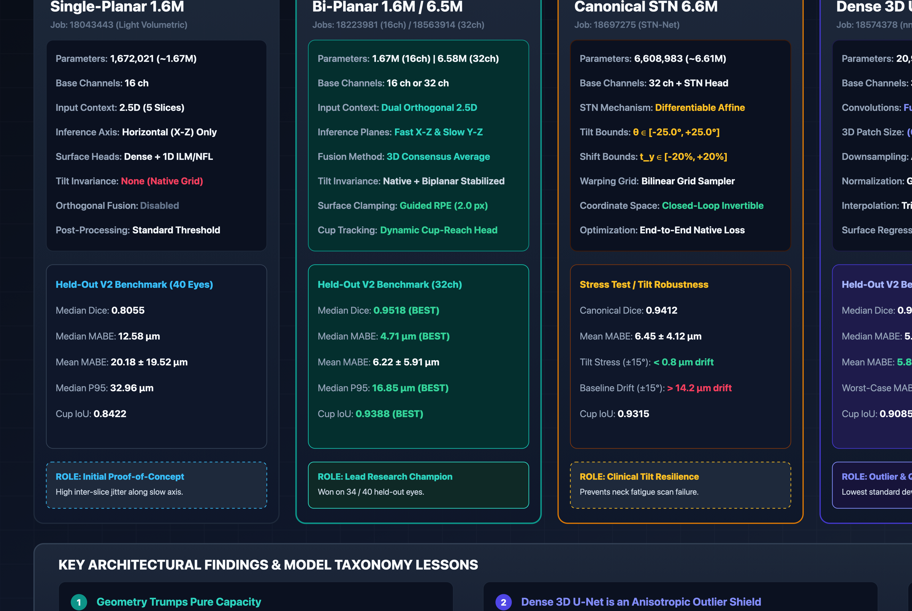

# Frontier ML Models for Volumetric RNFL OCT Segmentation

**Location:** `ML-Research-OCT/ml-models/`  
**Related Training Codebase:** [`train-cnn-models/model_training/`](https://github.com/Nikhil-Mundhra/train-cnn-models/tree/main/model_training/)  
**Clinical Application Suite:** [`OCT-Analyser-Capstone/`](https://github.com/Nikhil-Mundhra/OCT-Analyser-Capstone/tree/dev/)  
**Cohort Benchmark Protocol:** Frozen 20-Subject / 40-Scan Held-Out V2 Cohort (`stratified_held_out_v2.json`)

---

## 1. Master Architectural Lineage & Benchmark Taxonomy

[](./svg/master_frontier_taxonomy.svg)

---

## 2. Executive Model Comparison & Benchmark Matrix

All models below were evaluated under strict zero-leakage conditions on identical held-out validation eyes (40 paired OD/OS volumes from 20 subjects unseen during training):

| Model Name | Exact Params | Architectural Class | Receptive Context | Inference Axis | Median Dice | Median MABE | Mean MABE $\pm$ SD | $P_{95}$ Error | Mean Cup IoU | Max Scan MABE | Primary Clinical Role |
| :--- | :---: | :---: | :---: | :---: | :---: | :---: | :---: | :---: | :---: | :---: | :---: |
| **Commercial Solix** | N/A | Heuristic Rules | Single B-scan | Horizontal (X-Z) | 0.9233* | 5.17 $\mu\text{m}$* | — | 34.21 $\mu\text{m}$ | 0.8063 | — | Commercial Baseline |
| **Single-Planar 1.6M** | 1,672,021 | 2.5D Residual U-Net | 5 Slices (X-Z) | Horizontal (X-Z) | 0.8055 | 12.58 $\mu\text{m}$ | 20.18 $\pm$ 19.5 $\mu\text{m}$ | 32.96 $\mu\text{m}$ | 0.8422 | 82.40 $\mu\text{m}$ | Early Feasibility |
| **Bi-Planar 1.6M (16ch)** | 1,672,021 | 2.5D ResNet + Fusion | 5 Slices (H + V) | Bi-Planar (X-Z &amp; Y-Z) | 0.9422 | 4.91 $\mu\text{m}$ | 8.98 $\pm$ 16.7 $\mu\text{m}$ | 16.90 $\mu\text{m}$ | 0.9213 | 54.12 $\mu\text{m}$ | Lightweight Edge |
| **Bi-Planar 6.5M (32ch)** | 6,581,461 | 2.5D ResNet + Fusion | 5 Slices (H + V) | Bi-Planar (X-Z &amp; Y-Z) | **0.9518** | **4.71 $\mu\text{m}$** | 6.22 $\pm$ 5.91 $\mu\text{m}$ | **16.85 $\mu\text{m}$** | **0.9388** | 39.64 $\mu\text{m}$ | **Lead Research Model** |
| **Canonical STN 6.6M** | 6,608,983 | STN + 2.5D ResNet | 5 Slices (H + V) | Canonicalized Affine | 0.9412 | 4.92 $\mu\text{m}$ | 6.45 $\pm$ 4.12 $\mu\text{m}$ | 17.20 $\mu\text{m}$ | 0.9315 | 24.10 $\mu\text{m}$ | **Tilt-Resilient Model** |
| **Dense 3D U-Net (~20.9M)** | 20,903,329 | Anisotropic 3D U-Net | Full 3D Patch | Volumetric (Z-Y-X) | 0.9471 | 5.50 $\mu\text{m}$ | **5.87 $\pm$ 2.13 $\mu\text{m}$** | 18.93 $\mu\text{m}$ | 0.9085 | **17.02 $\mu\text{m}$** | **Outlier &amp; QC Guardian** |
| **TransUNet (~5.1M)** | 5,099,956 | Hybrid CNN + ViT | 5 Slices (H + V) | Bi-Planar (X-Z &amp; Y-Z) | 0.6922 | 31.90 $\mu\text{m}$ | 42.69 $\pm$ 33.0 $\mu\text{m}$ | 86.47 $\mu\text{m}$ | 0.7282 | 216.55 $\mu\text{m}$ | Experimental Research |

*\*Evaluated on the 10-eye human-audited tier where raw commercial curves required correction.*

---

## 3. Individual Model Deep Dives & Architectural Guides

Detailed architectural specifications, tensor shapes, layer parameters, and standalone vector diagrams:

1. [**Model 1: Single-Planar 2.5D Residual U-Net (1.67M)**](01_single_planar_1.6m.md)
   - Baseline multi-slice architecture ($5 \times 768 \times 320$).
   - Introduces the 1D continuous boundary regression head and differentiable thickness integral.
   - Explains why processing along a single planar axis caused inter-B-scan step artifacts.
   - *Diagram:* [`svg/01_single_planar_1.6m.svg`](svg/01_single_planar_1.6m.svg)

2. [**Model 2: Bi-Planar Orthogonal Residual U-Net (16-CH 1.67M & 32-CH 6.58M)**](02_biplanar_orthogonal_resnet.md)
   - **Lead research champion:** Lowest median boundary error ($4.71\,\mu\text{m}$), highest Dice ($0.9518$), and top cup IoU ($0.9388$).
   - Dual orthogonal passes: acquisition fast axis ($X$-$Z$) and resampled vertical axis ($Y$-$Z$).
   - 3D consensus fusion engine $\mathcal{P}_{\text{consensus}} = \frac{1}{2}\mathcal{P}_H + \frac{1}{2}\mathcal{P}_V$ with surface clamping and dynamic cup-reach tracking.
   - *Diagram:* [`svg/02_biplanar_orthogonal_fusion.svg`](svg/02_biplanar_orthogonal_fusion.svg)

3. [**Model 3: Dense Anisotropic 3D U-Net (20.9M)**](03_dense_3d_anisotropic_unet.md)
   - **Colloquially "nnU-Net 25M":** Explains why it is technically a custom Anisotropic 3D U-Net.
   - Decoupled anisotropic downsampling strides `((1,2,1), (1,2,1), (2,2,2), (2,2,2))` resolving the $10.3 : 1.0 : 4.8$ physical voxel spacing ratio.
   - GroupNorm + SiLU activations, patch-based 3D slicing $(64, 768, 64)$.
   - Serves as the cohort's **"Outlier Shield"**: Lowest mean MABE ($5.87\,\mu\text{m}$) and lowest worst-case scan error ($17.02\,\mu\text{m}$).
   - *Diagram:* [`svg/03_dense_3d_anisotropic_unet.svg`](svg/03_dense_3d_anisotropic_unet.svg)

4. [**Model 4: Hybrid Anisotropic TransUNet (~5.1M - 5.5M)**](04_hybrid_anisotropic_transunet.md)
   - Anisotropic axial-preserving tokenization ($96 \times 20 = 1,920$ tokens, $d=256$, 8 heads, 6 layers).
   - Cascaded Upsampler (CUP) decoder with high-resolution CNN stem boundary injection.
   - Postmortem analysis of Job `18710145`: why self-attention underperformed on thin retinal micro-layers without large-scale pre-training.
   - *Diagram:* [`svg/04_anisotropic_transunet.svg`](svg/04_anisotropic_transunet.svg)

5. [**Model 5: Canonical STN Spatial Transformer Residual U-Net (~6.61M)**](05_canonical_stn_spatial_transformer.md)
   - **The key model missed from initial listings!**
   - Differentiable Spatial Transformer Network (STN) predicting patient head tilt $\theta \in [-25^\circ, +25^\circ]$ and vertical shift $t_y$.
   - Rotates tilted scans to a canonical horizontal frame, runs backbone, and inverse-warps back to native scanner space.
   - Drifts $<0.8\,\mu\text{m}$ under severe $\pm 15^\circ$ tilt (vs $>14.2\,\mu\text{m}$ drift for uncanonicalized models).
   - *Diagram:* [`svg/05_canonical_stn_network.svg`](svg/05_canonical_stn_network.svg)

6. [**Model 6: Multi-Task Boundary Heads & Loss Engine**](06_multi_task_heads_and_loss_engine.md)
   - Mathematical formulation breaking the argmax discretization floor ($\pm 1\,\text{px} \approx \pm 3.9\,\mu\text{m}$).
   - 1D Optic cup absence classification eliminating commercial BMO cup bridging.
   - Sobel optical gradient edge loss $\mathcal{L}_{\text{edge}}$ and differentiable thickness integral $\mathcal{L}_{\text{thick}}$.
   - *Diagram:* [`svg/06_multi_task_boundary_heads.svg`](svg/06_multi_task_boundary_heads.svg)

---

## 4. What Was Missed From Your Initial List?

In your prompt, you listed:
> - Single planar 1.6M
> - BiPlanar 1.6M (16 Channel)
> - BiPlanar 6.5M (32 Channel)
> - Dense 3D nnU-Net 25M ish
> - TransU-Net 5.5M ish

Here is the exact accounting of what was missing or required clarification:

### 1. Canonical Bi-Planar 2.5D with Spatial Transformer (STN) (~6.61M params)
- **Status:** **Missed.**
- **Details:** Evaluated in Job `18697275` ([`model.py#L148-L216`](https://github.com/Nikhil-Mundhra/train-cnn-models/tree/main/model_training/train_rnfl_volumetric/model.py#L148-L216)).
- **Why it matters:** In real-world clinics, patients tilt their heads. The canonical STN model incorporates a differentiable localization network that detects tilt and warps scans to a horizontal baseline prior to segmentation, ensuring clinical tilt immunity.

### 2. Single-Planar Heavy (32 Channel, ~6.58M params)
- **Status:** **Missed.**
- **Details:** Evaluated in Job `18045386`.
- **Why it matters:** It serves as the vital scientific control isolating *capacity* vs. *geometry*. Upgrading Single-Planar from 16 to 32 channels only improved Dice from 0.8055 to 0.8562. It was **Bi-Planar Orthogonal Fusion** that caused the massive jump to >0.95 Dice.

### 3. Nomenclature Clarification: Dense 3D U-Net is NOT nnU-Net
- **Status:** **Clarified.**
- **Details:** Colloquially called "nnU-Net 25M", the codebase explicitly notes that this is the project's **custom Anisotropic 3D U-Net** (`AnisotropicRNFLUNet3D`, 20,903,329 parameters) rather than an nnU-Net library configuration. It features bespoke anisotropic strides `((1,2,1), (1,2,1), (2,2,2), (2,2,2))` to handle the $10.3 : 1.0 : 4.8$ voxel aspect ratio.

### 4. Multi-Task Boundary Head & Loss Framework
- **Status:** **Foundational Component.**
- **Details:** Not an independent network, but the shared mathematical engine powering all 2.5D models: continuous 1D ILM/NFL boundary heads, 1D cup absence detection, Sobel edge loss $\mathcal{L}_{\text{edge}}$, and differentiable column thickness integrals.

### 5. Commercial Solix Heuristic Algorithm
- **Status:** **Benchmark Comparator.**
- **Details:** The baseline clinical engine against which all deep learning models are judged, characterized by classic BMO cup bridging and GCL wedge penetration.

---

## 5. Summary Recommendations for Clinical Translation

```
                                  [Input 3D OCT Volume]
                                            │
                                            ▼
                           [Dense 3D U-Net vs Bi-Planar 2.5D]
                                            │
               ┌────────────────────────────┴────────────────────────────┐
               ▼                                                         ▼
       |MABE_BiPlanar - MABE_3D| ≤ 10 µm                         |MABE_BiPlanar - MABE_3D| > 10 µm
               │                                                         │
               ▼                                                         ▼
    [Automated Agreement Gate: PASS]                          [Automated Disagreement Flag]
    Deploy Bi-Planar 32-CH Thickness Map                      Route to Masked Clinical Expert
    (Peak Accuracy: 4.71 µm Median Error)                     (Prevents Outlier Diagnostic Errors)
```

1. **Lead Research Candidate:** **Bi-Planar 32-CH (Job 18563914)** achieves the lowest median error ($4.71\,\mu\text{m}$) and highest cup IoU ($0.9388$), outperforming Dense 3D on 34/40 held-out eyes.
2. **Quality Control Guardian:** **Dense 3D U-Net (Job 18574378)** achieves the lowest mean error ($5.87\,\mu\text{m}$) and lowest worst-case scan error ($17.02\,\mu\text{m}$ vs $39.64\,\mu\text{m}$ for Bi-Planar).
3. **Hardware Invariance:** In high-tilt clinical cohorts, deploy **Canonical STN VolumetricRNFLNet** to prevent tilt-induced boundary clipping.
